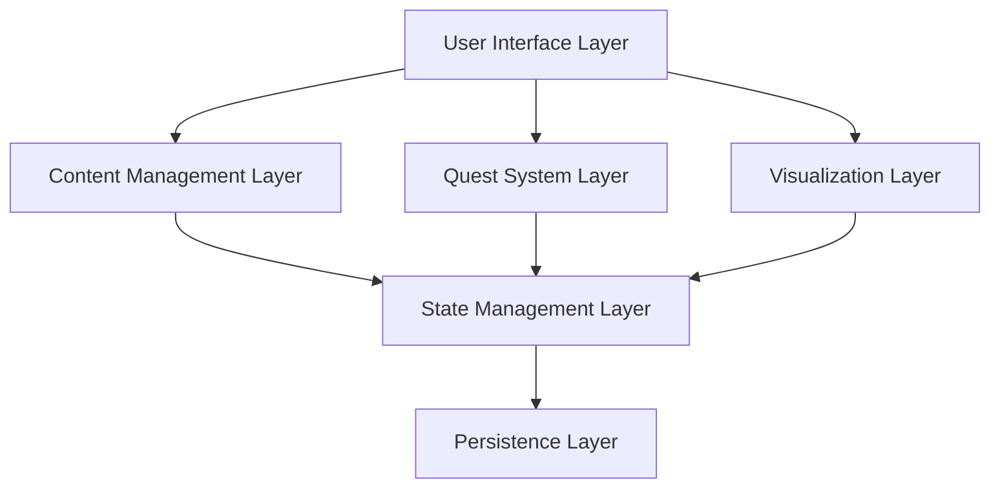

# Design Document: GP2.03 Gas Laws Module

## Overview

The GP2.03 Gas Laws module is an educational web application built with React and TypeScript that teaches Gymnasium students fundamental gas laws through interactive visualizations, progressive quests, and Basel-specific scenarios. The module implements a three-stage learning progression (BASIC_GAS_LAWS → IDEAL_GAS_EQUATION → GAS_MIXTURES) with 60 quests distributed across four difficulty levels.

The architecture follows a component-based design with clear separation between content management, quest logic, visualization components, and state management. The module supports three languages (EN/CN/DE) with consistent mathematical notation using LaTeX rendering.

## Architecture

### High-Level Architecture



### Component Hierarchy

```
ModuleContainer
├── ChamberLayout
│   ├── StageNavigator
│   ├── StageContent
│   │   ├── ScenarioCard
│   │   ├── ConceptExplanation
│   │   └── QuestList
│   └── VisualizationPanel
│       ├── GasLawSimulator
│       ├── PVDiagram
│       └── PartialPressureCalculator
├── LanguageSelector
└── ProgressTracker
```

### Data Flow

1. User interactions trigger events in UI components
2. Events dispatch actions to state management layer
3. State updates propagate to relevant components via subscriptions
4. Quest completions and progress changes persist to storage
5. Visualizations read state and render based on current parameters

## Components and Interfaces

### Core Components

#### ModuleContainer

Top-level component that orchestrates the entire module.

```typescript
interface ModuleContainerProps {
  moduleCode: string; // "GP2.03"
  initialLanguage?: Language;
}

interface ModuleState {
  currentStage: StageId;
  currentLanguage: Language;
  questProgress: QuestProgressMap;
  visualizationState: VisualizationStateMap;
}
```

#### ChamberLayout

Responsive layout component for organizing module content.

```typescript
interface ChamberLayoutProps {
  stage: Stage;
  language: Language;
  onStageChange: (stageId: StageId) => void;
  children: React.ReactNode;
}

// Responsive breakpoints
const BREAKPOINTS = {
  mobile: 375,
  tablet: 768,
  desktop: 1024
};
```

#### StageContent

Renders stage-specific content including scenarios, concepts, and quests.

```typescript
interface StageContentProps {
  stage: Stage;
  language: Language;
  questProgress: QuestProgressMap;
  onQuestComplete: (questId: string) => void;
}

interface Stage {
  id: StageId;
  name: LocalizedString;
  description: LocalizedString;
  scenarios: Scenario[];
  concepts: Concept[];
  quests: Quest[];
}
```

### Quest System Components

#### Quest

Represents an individual learning exercise.

```typescript
interface Quest {
  id: string;
  stageId: StageId;
  difficulty: Difficulty;
  title: LocalizedString;
  description: LocalizedString;
  problem: LocalizedString;
  solution: QuestSolution;
  hints: LocalizedString[];
  requiredQuests: string[]; // Prerequisites
}

type Difficulty = "BASIC" | "CORE" | "ADVANCED" | "ELITE";

interface QuestSolution {
  type: "numerical" | "multiple-choice" | "expression";
  correctAnswer: number | string | string[];
  unit?: string;
  tolerance?: number; // For numerical answers (default 0.02)
  explanation: LocalizedString;
}
```

#### QuestValidator

Validates student answers with appropriate tolerance and unit checking.

```typescript
interface QuestValidator {
  validate(
    quest: Quest,
    studentAnswer: string | number,
    studentUnit?: string
  ): ValidationResult;
}

interface ValidationResult {
  isCorrect: boolean;
  feedback: LocalizedString;
  correctAnswer?: number | string;
  relativeError?: number;
}

// Validation logic
function validateNumerical(
  correct: number,
  student: number,
  tolerance: number = 0.02
): boolean {
  const relativeError = Math.abs((student - correct) / correct);
  return relativeError <= tolerance;
}
```

#### QuestProgressTracker

Manages quest completion state and progression logic.

```typescript
interface QuestProgressTracker {
  markComplete(questId: string): void;
  isComplete(questId: string): boolean;
  canAccess(questId: string): boolean;
  getStageProgress(stageId: StageId): StageProgress;
}

interface StageProgress {
  totalQuests: number;
  completedQuests: number;
  completionPercentage: number;
  isUnlocked: boolean;
}

interface QuestProgressMap {
  [questId: string]: {
    completed: boolean;
    attempts: number;
    lastAttemptTime: number;
  };
}
```

### Visualization Components

#### GasLawSimulator

Interactive visualization for demonstrating Boyle's, Charles's, and Avogadro's Laws.

```typescript
interface GasLawSimulatorProps {
  law: "boyle" | "charles" | "avogadro";
  language: Language;
  onParameterChange?: (params: GasParameters) => void;
}

interface GasParameters {
  pressure: number; // Pa
  volume: number; // m³
  temperature: number; // K
  moles: number; // mol
}

interface SimulatorState extends GasParameters {
  animationSpeed: number;
  particleCount: number;
  containerDimensions: { width: number; height: number };
}
```

Visualization features:
- Real-time particle animation showing gas behavior
- Adjustable sliders for P, V, T, n parameters
- Visual feedback showing relationship between variables
- Numerical display of current values with units
- Update latency < 100ms for smooth interaction

#### PVDiagram

Interactive pressure-volume diagram for visualizing thermodynamic processes.

```typescript
interface PVDiagramProps {
  processes: ThermodynamicProcess[];
  language: Language;
  interactive?: boolean;
  onPointHover?: (point: PVPoint) => void;
}

interface ThermodynamicProcess {
  type: "isothermal" | "isobaric" | "isochoric" | "adiabatic";
  startState: GasState;
  endState: GasState;
  color: string;
}

interface GasState {
  pressure: number; // Pa
  volume: number; // m³
  temperature: number; // K
  moles: number; // mol
}

interface PVPoint {
  pressure: number;
  volume: number;
  temperature?: number;
}
```

Rendering logic:
- SVG-based graph with logarithmic or linear scales
- Curve rendering for different process types
- Interactive cursor showing P, V values
- Responsive sizing based on viewport
- Grid lines and axis labels with units

#### PartialPressureCalculator

Interactive tool for calculating partial pressures in gas mixtures.

```typescript
interface PartialPressureCalculatorProps {
  language: Language;
  maxGases?: number; // Default 5
  onCalculate?: (result: MixtureResult) => void;
}

interface GasComponent {
  id: string;
  name: string;
  moles: number;
  molarMass?: number;
}

interface MixtureResult {
  totalPressure: number; // Pa
  totalMoles: number;
  components: {
    gas: GasComponent;
    moleFraction: number;
    partialPressure: number;
  }[];
  isValid: boolean;
  validationErrors: string[];
}

// Calculation functions
function calculatePartialPressure(
  moles: number,
  totalMoles: number,
  totalPressure: number
): number {
  return (moles / totalMoles) * totalPressure;
}

function validateMoleFractions(fractions: number[]): boolean {
  const sum = fractions.reduce((a, b) => a + b, 0);
  return Math.abs(sum - 1.0) <= 0.001;
}
```

### Content Management Components

#### ContentRenderer

Renders multilingual content with LaTeX support.

```typescript
interface ContentRendererProps {
  content: LocalizedString;
  language: Language;
  renderMath?: boolean; // Default true
}

type LocalizedString = {
  en: string;
  cn: string;
  de: string;
};

type Language = "en" | "cn" | "de";

// LaTeX rendering using KaTeX or MathJax
function renderLatex(text: string): string {
  // Replace inline math: $...$
  // Replace display math: $$...$$
  // Preserve formatting and units
}
```

#### ScenarioCard

Displays Basel-specific scenarios with contextual information.

```typescript
interface ScenarioCardProps {
  scenario: Scenario;
  language: Language;
  expanded?: boolean;
}

interface Scenario {
  id: string;
  title: LocalizedString;
  description: LocalizedString; // 150-250 words
  location?: BaselLocation;
  imageUrl?: string;
  relatedConcepts: string[];
}

interface BaselLocation {
  name: LocalizedString;
  coordinates?: { lat: number; lng: number };
  description: LocalizedString;
}
```

Scenarios:
1. Chemical industry gas storage (Roche/Novartis)
2. Hot air balloon festival
3. University chemistry lab
4. Rhine River atmospheric variations

### State Management

#### ModuleStore

Central state management using a reactive store pattern (e.g., Zustand, Redux).

```typescript
interface ModuleStore {
  // State
  currentStage: StageId;
  currentLanguage: Language;
  questProgress: QuestProgressMap;
  visualizationState: VisualizationStateMap;
  
  // Actions
  setStage: (stageId: StageId) => void;
  setLanguage: (language: Language) => void;
  completeQuest: (questId: string) => void;
  updateVisualization: (vizId: string, state: any) => void;
  
  // Selectors
  getStageProgress: (stageId: StageId) => StageProgress;
  canAccessQuest: (questId: string) => boolean;
  getCompletionPercentage: () => number;
}

type StageId = "BASIC_GAS_LAWS" | "IDEAL_GAS_EQUATION" | "GAS_MIXTURES";

interface VisualizationStateMap {
  gasLawSimulator: GasParameters;
  pvDiagram: PVDiagramState;
  partialPressureCalc: MixtureResult;
}
```

### Persistence Layer

#### StorageAdapter

Abstracts storage operations for quest progress and preferences.

```typescript
interface StorageAdapter {
  save(key: string, value: any): Promise<void>;
  load(key: string): Promise<any>;
  clear(key: string): Promise<void>;
}

// Implementation using localStorage with fallback
class LocalStorageAdapter implements StorageAdapter {
  private prefix = "gp2-03-gas-laws";
  
  async save(key: string, value: any): Promise<void> {
    const fullKey = `${this.prefix}:${key}`;
    localStorage.setItem(fullKey, JSON.stringify(value));
  }
  
  async load(key: string): Promise<any> {
    const fullKey = `${this.prefix}:${key}`;
    const item = localStorage.getItem(fullKey);
    return item ? JSON.parse(item) : null;
  }
  
  async clear(key: string): Promise<void> {
    const fullKey = `${this.prefix}:${key}`;
    localStorage.removeItem(fullKey);
  }
}
```

Storage keys:
- `quest-progress`: QuestProgressMap
- `current-stage`: StageId
- `language-preference`: Language
- `visualization-history`: VisualizationStateMap

## Data Models

### Quest Data Structure

```typescript
// Quest distribution across stages and difficulties
const QUEST_DISTRIBUTION = {
  BASIC_GAS_LAWS: {
    BASIC: 15,
    CORE: 0,
    ADVANCED: 0,
    ELITE: 0
  },
  IDEAL_GAS_EQUATION: {
    BASIC: 0,
    CORE: 20,
    ADVANCED: 0,
    ELITE: 0
  },
  GAS_MIXTURES: {
    BASIC: 0,
    CORE: 0,
    ADVANCED: 15,
    ELITE: 10
  }
};

// Total: 60 quests (15 BASIC + 20 CORE + 15 ADVANCED + 10 ELITE)
```

### Gas Constants and Units

```typescript
const GAS_CONSTANT = {
  R: 8.314, // J/(mol·K)
  R_atm: 0.08206, // L·atm/(mol·K)
  R_bar: 0.08314 // L·bar/(mol·K)
};

const STANDARD_CONDITIONS = {
  STP: {
    temperature: 273.15, // K (0°C)
    pressure: 101325 // Pa (1 atm)
  },
  SATP: {
    temperature: 298.15, // K (25°C)
    pressure: 100000 // Pa (1 bar)
  }
};

// Unit conversion factors
const CONVERSIONS = {
  pressure: {
    Pa_to_atm: 1 / 101325,
    Pa_to_bar: 1 / 100000,
    Pa_to_mmHg: 760 / 101325
  },
  volume: {
    m3_to_L: 1000,
    m3_to_mL: 1000000,
    L_to_m3: 0.001
  },
  temperature: {
    C_to_K: (c: number) => c + 273.15,
    K_to_C: (k: number) => k - 273.15
  }
};
```

### Stage Progression Logic

```typescript
interface StageUnlockRules {
  BASIC_GAS_LAWS: {
    unlocked: true; // Always available
    requiredCompletion: 0;
  };
  IDEAL_GAS_EQUATION: {
    unlocked: false;
    requiredCompletion: 0.8; // 80% of BASIC_GAS_LAWS
    requiredStage: "BASIC_GAS_LAWS";
  };
  GAS_MIXTURES: {
    unlocked: false;
    requiredCompletion: 0.8; // 80% of IDEAL_GAS_EQUATION
    requiredStage: "IDEAL_GAS_EQUATION";
  };
}

function canUnlockStage(
  stageId: StageId,
  progress: QuestProgressMap
): boolean {
  const rules = StageUnlockRules[stageId];
  if (rules.unlocked) return true;
  
  const requiredStage = rules.requiredStage;
  const stageProgress = calculateStageProgress(requiredStage, progress);
  
  return stageProgress.completionPercentage >= rules.requiredCompletion;
}
```


## Correctness Properties

*A property is a characteristic or behavior that should hold true across all valid executions of a system—essentially, a formal statement about what the system should do. Properties serve as the bridge between human-readable specifications and machine-verifiable correctness guarantees.*

### Property 1: Quest completion triggers state persistence

*For any* quest completion event, the Quest_System should immediately persist the updated completion state to storage, and the persisted state should be retrievable in subsequent sessions.

**Validates: Requirements 1.5, 11.1, 11.2**

### Property 2: Partial pressure calculations obey Dalton's Law

*For any* valid gas mixture with up to 5 component gases, the Partial_Pressure_Calculator should compute partial pressures such that their sum equals the total pressure within numerical tolerance (±0.1 Pa), and the sum of mole fractions equals 1.0 within tolerance (±0.001).

**Validates: Requirements 4.3, 4.5**

### Property 3: Ideal gas equation quests involve multiple variables

*For any* quest in the IDEAL_GAS_EQUATION stage, the quest problem should require calculations involving at least three of the four variables (P, V, n, T).

**Validates: Requirements 3.3**

### Property 4: Simulator updates respond in real-time

*For any* parameter adjustment in the Gas_Law_Simulator, the visual representation should update within 100ms of the parameter change event.

**Validates: Requirements 6.2**

### Property 5: PV Diagram displays cursor values

*For any* cursor position within the PV_Diagram interactive area, the diagram should display the corresponding pressure and volume values at that position.

**Validates: Requirements 6.3**

### Property 6: Mathematical content uses LaTeX notation

*For any* mathematical formula, subscript, superscript, or Greek letter in the module content, the Content_Renderer should use proper LaTeX syntax for rendering.

**Validates: Requirements 7.1, 7.3, 7.5**

### Property 7: SI units and constants used consistently

*For any* numerical value with units or calculation using physical constants, the module should use SI notation (Pa, m³, K, mol) and the gas constant R = 8.314 J/(mol·K) consistently throughout all content and calculations.

**Validates: Requirements 7.4, 12.4**

### Property 8: Language selection displays all content in chosen language

*For any* language selection (EN, CN, or DE), the Content_Renderer should display all text content (quest descriptions, scenarios, instructions) in that language while preserving mathematical notation and identifiers.

**Validates: Requirements 8.2, 8.3**

### Property 9: Mathematical notation consistent across languages

*For any* mathematical formula or equation, the notation should remain identical across all three language versions (EN, CN, DE).

**Validates: Requirements 8.4**

### Property 10: Quest characteristics match difficulty classification

*For any* quest, the quest content should match its difficulty classification: BASIC quests involve single-law applications with provided formulas, CORE quests require PV=nRT with unit conversions, ADVANCED quests involve multi-step calculations or gas mixtures, and ELITE quests require synthesis of multiple concepts.

**Validates: Requirements 9.1, 9.2, 9.3, 9.4**

### Property 11: Persistence round-trip preserves state

*For any* module state (quest progress, language preference, visualization settings), saving the state and then reloading the module should restore the exact same state.

**Validates: Requirements 11.2, 11.4**

### Property 12: Numerical validation accepts answers within tolerance

*For any* numerical quest answer, the Quest_System should accept student answers within 2% relative error of the correct value, calculated as |student - correct| / |correct| ≤ 0.02.

**Validates: Requirements 12.1**

### Property 13: Unit validation enforces correct SI units

*For any* quest answer requiring units, the Quest_System should validate both the numerical value and the unit, rejecting answers with incorrect units even if the numerical value is within tolerance.

**Validates: Requirements 12.2, 12.3**

## Error Handling

### Input Validation Errors

**Invalid Gas Parameters:**
- Negative pressure, volume, temperature, or moles
- Temperature below absolute zero (< 0 K)
- Zero or negative moles in calculations
- Error message: "Invalid parameter: [parameter] must be positive"
- Action: Reject input, display error, maintain previous valid state

**Invalid Mole Fractions:**
- Mole fractions that don't sum to 1.0 (tolerance ±0.001)
- Negative mole fractions
- Error message: "Mole fractions must sum to 1.0 (current sum: [value])"
- Action: Highlight invalid inputs, prevent calculation

**Unit Mismatches:**
- Student answer uses non-SI units without conversion
- Missing units when required
- Error message: "Answer must include correct SI units (expected: [unit])"
- Action: Mark answer incorrect, provide feedback

### Calculation Errors

**Numerical Overflow/Underflow:**
- Calculations resulting in values outside JavaScript number range
- Error message: "Calculation result out of range"
- Action: Display error, suggest checking input values

**Division by Zero:**
- Attempts to calculate with zero moles, volume, or temperature
- Error message: "Cannot calculate: [parameter] cannot be zero"
- Action: Prevent calculation, highlight problematic input

**Floating-Point Precision:**
- Use fixed decimal precision for display (4 significant figures)
- Round intermediate calculations to avoid accumulation errors
- Compare values using relative error, not exact equality

### Storage Errors

**localStorage Unavailable:**
- Browser privacy mode or storage disabled
- Fallback: Use in-memory storage for session
- Warning message: "Progress will not be saved between sessions"

**Storage Quota Exceeded:**
- Attempt to save when storage is full
- Action: Clear old visualization history, retry save
- Error message: "Unable to save progress: storage full"

**Corrupted Data:**
- Invalid JSON in stored data
- Action: Clear corrupted data, reset to default state
- Warning message: "Progress data corrupted, resetting to defaults"

### Rendering Errors

**LaTeX Rendering Failure:**
- Invalid LaTeX syntax in content
- Fallback: Display raw text with warning indicator
- Log error for content correction

**Visualization Rendering Failure:**
- Canvas/SVG not supported
- Fallback: Display static image or text description
- Message: "Interactive visualization unavailable"

**Responsive Layout Issues:**
- Viewport too small (< 375px)
- Action: Display minimum-width warning
- Message: "For best experience, use a larger screen"

### Network and Loading Errors

**Content Loading Failure:**
- Quest data or scenarios fail to load
- Retry logic: 3 attempts with exponential backoff
- Fallback: Display cached content if available
- Error message: "Unable to load content, please refresh"

**Language Data Missing:**
- Selected language translations unavailable
- Fallback: Use English (EN) as default
- Warning message: "Translation unavailable, displaying in English"

## Testing Strategy

### Dual Testing Approach

The module requires both unit tests and property-based tests for comprehensive coverage:

- **Unit tests**: Verify specific examples, edge cases, error conditions, and integration points
- **Property tests**: Verify universal properties across randomized inputs (minimum 100 iterations per test)

Unit tests focus on concrete scenarios and boundary conditions, while property tests validate general correctness across the input space. Both are necessary and complementary.

### Property-Based Testing Configuration

**Library Selection:**
- TypeScript/JavaScript: Use `fast-check` library for property-based testing
- Minimum 100 iterations per property test (due to randomization)
- Each test must reference its design document property

**Test Tagging Format:**
```typescript
// Feature: gp2-03-gas-laws, Property 1: Quest completion triggers state persistence
test('quest completion persists state', () => {
  fc.assert(fc.property(
    questArbitrary,
    (quest) => {
      // Test implementation
    }
  ), { numRuns: 100 });
});
```

### Unit Testing Focus Areas

**Specific Examples:**
- Boyle's Law calculation: P₁=2atm, V₁=1L → P₂=1atm, V₂=?
- Charles's Law calculation: V₁=1L, T₁=273K → T₂=546K, V₂=?
- Ideal gas equation: P=101325Pa, V=0.0224m³, T=273K → n=?
- Partial pressure: 2mol N₂ + 1mol O₂ at 3atm total → P(N₂)=?, P(O₂)=?

**Edge Cases:**
- Zero moles (should error)
- Absolute zero temperature (should error)
- Very large/small values (test numerical stability)
- Single gas in mixture (partial pressure = total pressure)
- Empty quest list (should display appropriate message)

**Error Conditions:**
- Invalid units in answer validation
- Corrupted localStorage data
- Missing translation data
- LaTeX syntax errors in content
- Viewport below minimum width

**Integration Points:**
- Quest completion → storage → state restoration
- Language selection → content update → LaTeX re-rendering
- Parameter change → visualization update → display refresh
- Stage unlock → quest availability → UI update

### Property-Based Testing Focus Areas

**Quest System Properties:**
- Property 1: Quest completion persistence (any quest → save → restore)
- Property 10: Quest difficulty characteristics (any quest → verify content matches difficulty)
- Property 12: Numerical validation tolerance (any answer within 2% → accept)
- Property 13: Unit validation (any answer with wrong units → reject)

**Calculation Properties:**
- Property 2: Dalton's Law (any gas mixture → sum of partial pressures = total)
- Property 3: Multi-variable quests (any IDEAL_GAS_EQUATION quest → uses ≥3 variables)
- Property 7: Consistent constants (any calculation with R → uses 8.314)

**UI and Rendering Properties:**
- Property 4: Simulator responsiveness (any parameter change → update < 100ms)
- Property 5: PV Diagram cursor values (any cursor position → display P,V)
- Property 6: LaTeX notation (any math content → uses LaTeX)
- Property 8: Language display (any language selection → all content in that language)
- Property 9: Math notation consistency (any formula → same across languages)

**Persistence Properties:**
- Property 11: Round-trip preservation (any state → save → load → same state)

### Test Data Generation

**Arbitrary Generators (for property tests):**

```typescript
// Gas parameters within realistic ranges
const gasParametersArbitrary = fc.record({
  pressure: fc.double({ min: 1000, max: 1000000 }), // 0.01-10 atm
  volume: fc.double({ min: 0.001, max: 1.0 }), // 1L - 1000L
  temperature: fc.double({ min: 200, max: 500 }), // -73°C to 227°C
  moles: fc.double({ min: 0.01, max: 100 })
});

// Quest with random difficulty and content
const questArbitrary = fc.record({
  id: fc.uuid(),
  difficulty: fc.constantFrom('BASIC', 'CORE', 'ADVANCED', 'ELITE'),
  // ... other fields
});

// Gas mixture with 1-5 components
const gasMixtureArbitrary = fc.array(
  fc.record({
    name: fc.string(),
    moles: fc.double({ min: 0.1, max: 10 })
  }),
  { minLength: 1, maxLength: 5 }
).map(components => {
  // Normalize to ensure mole fractions sum to 1.0
  const totalMoles = components.reduce((sum, c) => sum + c.moles, 0);
  return components.map(c => ({
    ...c,
    moleFraction: c.moles / totalMoles
  }));
});
```

### Coverage Goals

- **Line coverage**: ≥90% for core logic (quest system, calculations, validation)
- **Branch coverage**: ≥85% for conditional logic
- **Property coverage**: 100% of design properties implemented as tests
- **Requirements coverage**: All testable acceptance criteria covered by at least one test

### Continuous Testing

- Run unit tests on every commit
- Run property tests (100 iterations) on every pull request
- Run extended property tests (1000 iterations) nightly
- Monitor test execution time (unit tests < 5s, property tests < 30s)

