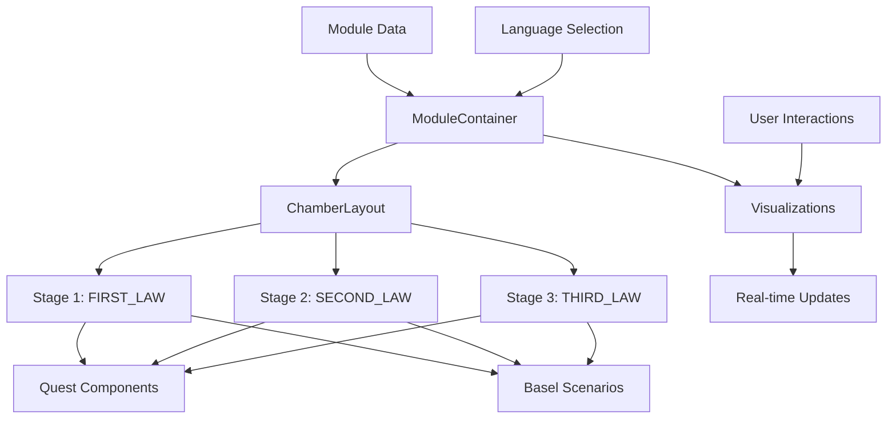

# Design Document: SP1.02 Newton's Laws Module

## Overview

The SP1.02 Newton's Laws module is an interactive educational component that teaches Newton's three laws of motion to Sekundarschule Sek 2 students (ages 14-16) through a gamified quest system. The module presents 75 physics problems across three stages (FIRST_LAW, SECOND_LAW, THIRD_LAW), incorporates Basel-specific scenarios, and provides interactive visualizations to help students explore force, mass, and acceleration relationships.

The module follows the established physics module architecture used in other curriculum modules, utilizing the Chamber_Layout component for consistent visual organization and supporting three languages (English, Chinese, German) to serve Basel's multilingual student population.

## Architecture

### High-Level Structure

```
SP1.02 Newton's Laws Module
├── Module Metadata (code, title, Lehrplan alignment)
├── Stage 1: FIRST_LAW (Inertia)
│   ├── Content (explanations, examples)
│   ├── Quests (distributed by difficulty)
│   └── Basel Scenario (Fasnacht parade floats)
├── Stage 2: SECOND_LAW (F=ma)
│   ├── Content (F=ma equation, relationships)
│   ├── Quests (calculation-focused)
│   └── Basel Scenario (tram acceleration)
├── Stage 3: THIRD_LAW (Action-Reaction)
│   ├── Content (action-reaction pairs)
│   ├── Quests (pair identification, analysis)
│   └── Basel Scenarios (Rhine boat, SBB station)
└── Interactive Visualizations
    ├── Inertia Simulator
    ├── F=ma Calculator
    └── Action-Reaction Demonstrator
```

### Component Architecture

The module follows a component-based architecture:

1. **ModuleContainer**: Top-level component managing module state and language selection
2. **ChamberLayout**: Organizes stages and quests into visual chambers
3. **StageComponent**: Renders individual stage content and quests
4. **QuestComponent**: Displays individual quest problems with difficulty indicators
5. **BaselScenarioComponent**: Renders contextualized Basel scenarios
6. **VisualizationComponents**: Three interactive visualizations for exploration
7. **LatexRenderer**: Handles mathematical notation rendering

### Data Flow



## Components and Interfaces

### Module Data Structure

```typescript
interface NewtonsLawsModule {
  code: string;              // "SP1.02"
  title: {
    en: string;
    cn: string;
    de: string;
  };
  lehrplanAlignment: string; // "NT.3.1.b"
  targetAudience: string;
  stages: Stage[];
  totalQuests: number;       // 75
  visualizations: Visualization[];
}

interface Stage {
  id: string;                // "FIRST_LAW", "SECOND_LAW", "THIRD_LAW"
  title: {
    en: string;
    cn: string;
    de: string;
  };
  content: StageContent;
  quests: Quest[];
  baselScenarios: BaselScenario[];
}

interface Quest {
  id: string;
  difficulty: "BASIC" | "CORE" | "ADVANCED" | "ELITE";
  stageId: string;
  problem: {
    en: string;
    cn: string;
    de: string;
  };
  solution: {
    en: string;
    cn: string;
    de: string;
  };
  hints?: string[];
  relatedLaw: "FIRST" | "SECOND" | "THIRD";
}

interface BaselScenario {
  id: string;
  title: {
    en: string;
    cn: string;
    de: string;
  };
  description: {
    en: string;
    cn: string;
    de: string;
  };
  wordCount: number;         // 150-250
  relatedQuests: string[];
  location: string;          // Basel location
}

interface Visualization {
  id: string;
  type: "INERTIA_SIMULATOR" | "FMA_CALCULATOR" | "ACTION_REACTION_DEMO";
  title: {
    en: string;
    cn: string;
    de: string;
  };
  parameters: Parameter[];
  renderFunction: (params: Record<string, number>) => VisualizationState;
}

interface Parameter {
  name: string;
  unit: string;
  min: number;
  max: number;
  default: number;
  step: number;
}
```

### ChamberLayout Component Interface

```typescript
interface ChamberLayoutProps {
  stages: Stage[];
  currentLanguage: "en" | "cn" | "de";
  onQuestSelect: (questId: string) => void;
  onStageChange: (stageId: string) => void;
  responsive: boolean;
}
```

### Visualization Component Interfaces

```typescript
// Inertia Simulator
interface InertiaSimulatorProps {
  initialVelocity: number;
  mass: number;
  appliedForce: number;
  frictionCoefficient: number;
  onParameterChange: (param: string, value: number) => void;
}

// F=ma Calculator
interface FmaCalculatorProps {
  force?: number;
  mass?: number;
  acceleration?: number;
  solveFor: "force" | "mass" | "acceleration";
  onCalculate: (result: number) => void;
}

// Action-Reaction Demonstrator
interface ActionReactionDemoProps {
  object1Mass: number;
  object2Mass: number;
  interactionForce: number;
  showForceVectors: boolean;
  onSimulate: () => void;
}
```

## Data Models

### Quest Distribution Model

The 75 quests are distributed across difficulty levels and stages:

```typescript
interface QuestDistribution {
  total: 75;
  byDifficulty: {
    BASIC: 20;    // Law understanding, simple calculations
    CORE: 25;     // F=ma applications, comprehensive analysis
    ADVANCED: 20; // Complex motion analysis
    ELITE: 10;    // Comprehensive applications across all laws
  };
  byStage: {
    FIRST_LAW: number;   // ~25 quests
    SECOND_LAW: number;  // ~25 quests
    THIRD_LAW: number;   // ~25 quests
  };
}
```

### Basel Scenario Model

```typescript
interface BaselScenarioContent {
  tramScenario: {
    title: "Basel Tram Acceleration and Braking";
    location: "Barfüsserplatz tram stop";
    description: string; // 150-250 words
    physicsContext: "F=ma application";
    questIds: string[];
  };
  rhineBoatScenario: {
    title: "Rhine River Boat Propulsion";
    location: "Rhine River near Mittlere Brücke";
    description: string; // 150-250 words
    physicsContext: "Action-reaction pairs";
    questIds: string[];
  };
  fasnachtScenario: {
    title: "Basel Fasnacht Parade Float Motion";
    location: "Marktplatz during Fasnacht";
    description: string; // 150-250 words
    physicsContext: "Inertia demonstration";
    questIds: string[];
  };
  sbbScenario: {
    title: "Basel SBB Train Station Platform Safety";
    location: "Basel SBB main station";
    description: string; // 150-250 words
    physicsContext: "Forces and motion safety";
    questIds: string[];
  };
}
```

### Language Support Model

```typescript
interface MultilingualContent {
  en: string;
  cn: string;
  de: string;
}

interface LanguageContext {
  currentLanguage: "en" | "cn" | "de";
  translations: {
    moduleTitle: MultilingualContent;
    stageNames: Record<string, MultilingualContent>;
    questContent: Record<string, MultilingualContent>;
    baselScenarios: Record<string, MultilingualContent>;
    uiLabels: Record<string, MultilingualContent>;
  };
}
```

### Responsive Design Model

```typescript
interface ResponsiveBreakpoints {
  mobile: {
    maxWidth: 768;
    layout: "single-column";
    chamberDisplay: "stacked";
    visualizationSize: "compact";
  };
  tablet: {
    minWidth: 769;
    maxWidth: 1024;
    layout: "two-column";
    chamberDisplay: "grid";
    visualizationSize: "medium";
  };
  desktop: {
    minWidth: 1025;
    layout: "three-column";
    chamberDisplay: "grid";
    visualizationSize: "full";
  };
}
```

## Correctness Properties


A property is a characteristic or behavior that should hold true across all valid executions of a system—essentially, a formal statement about what the system should do. Properties serve as the bridge between human-readable specifications and machine-verifiable correctness guarantees.

### Property 1: Module Structure Invariants

*For any* valid module configuration, the module must contain exactly three stages with IDs "FIRST_LAW", "SECOND_LAW", and "THIRD_LAW", and the total quest count across all stages must equal 75.

**Validates: Requirements 1.1, 1.3**

### Property 2: Quest Difficulty Distribution

*For any* valid module configuration, filtering quests by difficulty level must yield exactly 20 BASIC quests, 25 CORE quests, 20 ADVANCED quests, and 10 ELITE quests, with the sum equaling 75.

**Validates: Requirements 2.1, 2.2, 2.3, 2.4**

### Property 3: Quest Distribution Across Stages

*For any* valid module configuration, each of the three stages must contain at least one quest, ensuring no stage is empty.

**Validates: Requirements 2.6**

### Property 4: Stage Rendering Order

*For any* module rendering, the Chamber_Layout component must receive and display stages in the sequential order: FIRST_LAW, SECOND_LAW, THIRD_LAW.

**Validates: Requirements 1.2**

### Property 5: Quest Difficulty Display

*For any* quest rendering, the displayed output must include the quest's difficulty level (BASIC, CORE, ADVANCED, or ELITE).

**Validates: Requirements 2.5**

### Property 6: Basel Scenario Word Count Constraint

*For any* Basel scenario in the module, the word count of its description must be between 150 and 250 words inclusive.

**Validates: Requirements 6.5**

### Property 7: Basel Scenario Count Constraint

*For any* valid module configuration, the total number of Basel scenarios must be between 3 and 4 inclusive.

**Validates: Requirements 6.6**

### Property 8: Stage-Specific Basel Scenarios

*For any* valid module configuration, the FIRST_LAW stage must have at least one Basel scenario, the SECOND_LAW stage must have at least one Basel scenario, and the THIRD_LAW stage must have at least one Basel scenario.

**Validates: Requirements 3.5, 4.6, 5.5**

### Property 9: Visualization Real-Time Updates

*For any* visualization component and any two different parameter sets, calling the render function with different parameters must produce different visualization states.

**Validates: Requirements 7.4**

### Property 10: LaTeX Rendering for Equations

*For any* mathematical equation in the module content, the rendering pipeline must invoke the LaTeX renderer to format the equation.

**Validates: Requirements 8.1**

### Property 11: Unit Display in Calculations

*For any* quest that involves numerical calculations, the rendered output must include unit information for all calculated values.

**Validates: Requirements 8.4, 11.5**

### Property 12: Multilingual Content Completeness

*For any* content item in the module (titles, quest problems, scenarios, UI labels), the content must have translations in all three languages: English (en), Chinese (cn), and German (de).

**Validates: Requirements 9.1, 9.2, 9.3**

### Property 13: Language Selection Filtering

*For any* language selection ("en", "cn", or "de"), all displayed text content must be in the selected language, with no mixing of languages in the output.

**Validates: Requirements 9.4**

### Property 14: Responsive Layout Adaptation

*For any* two different viewport widths (mobile, tablet, desktop ranges), the responsive layout function must return different layout configurations appropriate to each screen size.

**Validates: Requirements 10.4**

### Property 15: Chamber Layout Quest Grouping

*For any* module rendering, each quest must be displayed within its corresponding stage section, with no quests appearing outside their assigned stage.

**Validates: Requirements 12.3**

### Property 16: Chamber Layout Navigation

*For any* stage in the module, the Chamber_Layout component must provide navigation functions to move between stages.

**Validates: Requirements 12.5**

## Error Handling

### Input Validation Errors

**Invalid Quest Data:**
- Missing required fields (id, difficulty, stageId, problem)
- Invalid difficulty level (not BASIC, CORE, ADVANCED, or ELITE)
- Invalid stageId (not FIRST_LAW, SECOND_LAW, or THIRD_LAW)
- Missing language translations

**Error Response:** Throw descriptive error with field name and expected format

**Invalid Basel Scenario Data:**
- Word count outside 150-250 range
- Missing required fields (id, title, description, location)
- Missing language translations

**Error Response:** Throw descriptive error with word count and valid range

**Invalid Visualization Parameters:**
- Parameter values outside min/max bounds
- Missing required parameters
- Invalid parameter types

**Error Response:** Clamp values to valid range and log warning, or throw error for missing parameters

### Runtime Errors

**Language Selection Errors:**
- Unsupported language code
- Missing translations for selected language

**Error Response:** Fall back to English (en) and log warning

**Rendering Errors:**
- LaTeX rendering failures
- Component rendering exceptions
- Missing visualization data

**Error Response:** Display error message to user, log error details, attempt graceful degradation

**Data Loading Errors:**
- Module data fetch failures
- Malformed JSON data
- Network timeouts

**Error Response:** Display user-friendly error message, provide retry mechanism, log error for debugging

### Validation Rules

1. **Module Validation:**
   - Exactly 3 stages with correct IDs
   - Exactly 75 quests total
   - Quest difficulty distribution: 20 BASIC, 25 CORE, 20 ADVANCED, 10 ELITE
   - 3-4 Basel scenarios
   - All scenarios have 150-250 word descriptions

2. **Quest Validation:**
   - Valid difficulty level
   - Valid stageId
   - Complete multilingual content (en, cn, de)
   - Non-empty problem and solution text

3. **Visualization Validation:**
   - All parameters within defined min/max bounds
   - Required parameters present
   - Valid parameter types (numbers)

## Testing Strategy

### Dual Testing Approach

The module will be tested using both unit tests and property-based tests to ensure comprehensive coverage:

- **Unit tests**: Verify specific examples, edge cases, and error conditions
- **Property tests**: Verify universal properties across all inputs

Both testing approaches are complementary and necessary. Unit tests catch concrete bugs in specific scenarios, while property tests verify general correctness across a wide range of inputs.

### Property-Based Testing

**Library Selection:**
- For TypeScript/JavaScript: Use **fast-check** library
- For Python (if used for data generation): Use **Hypothesis** library

**Configuration:**
- Each property test must run a minimum of 100 iterations
- Each test must be tagged with a comment referencing the design property
- Tag format: `// Feature: sp1-02-newtons-laws, Property {number}: {property_text}`

**Property Test Implementation:**
- Each correctness property listed above must be implemented as a single property-based test
- Tests should generate random valid module configurations and verify properties hold
- Use appropriate generators for quests, stages, scenarios, and visualizations

### Unit Testing

**Focus Areas:**
- Specific examples demonstrating correct behavior (e.g., specific quest rendering)
- Edge cases (e.g., exactly 150 words, exactly 250 words in scenarios)
- Error conditions (e.g., invalid difficulty level, missing translations)
- Integration points between components (e.g., ChamberLayout receiving stage data)

**Balance:**
- Avoid writing too many unit tests for cases covered by property tests
- Focus unit tests on concrete examples and integration scenarios
- Use unit tests to verify specific Basel scenarios and visualizations exist

### Test Coverage Requirements

1. **Module Structure Tests:**
   - Property test: Module structure invariants (Property 1)
   - Unit test: Specific module metadata (code "SP1.02", Lehrplan alignment)

2. **Quest Distribution Tests:**
   - Property test: Quest difficulty distribution (Property 2)
   - Property test: Quest distribution across stages (Property 3)
   - Unit test: Specific quest examples for each difficulty level

3. **Content Tests:**
   - Unit tests: Verify specific Newton's Law text content exists
   - Unit tests: Verify specific Basel scenarios exist (tram, Rhine boat, Fasnacht, SBB)
   - Property test: Basel scenario word count constraints (Property 6)
   - Property test: Basel scenario count (Property 7)

4. **Rendering Tests:**
   - Property test: Stage rendering order (Property 4)
   - Property test: Quest difficulty display (Property 5)
   - Property test: LaTeX rendering invocation (Property 10)
   - Unit test: Specific LaTeX equation rendering (F=ma)

5. **Visualization Tests:**
   - Property test: Real-time parameter updates (Property 9)
   - Unit tests: Specific visualization types exist (inertia, F=ma, action-reaction)
   - Unit tests: Parameter bounds validation

6. **Multilingual Tests:**
   - Property test: Multilingual content completeness (Property 12)
   - Property test: Language selection filtering (Property 13)
   - Unit tests: Specific translations for key terms

7. **Responsive Design Tests:**
   - Property test: Layout adaptation (Property 14)
   - Unit tests: Specific breakpoint behaviors

8. **Chamber Layout Tests:**
   - Property test: Quest grouping (Property 15)
   - Property test: Navigation support (Property 16)
   - Unit test: ChamberLayout component integration

### Error Handling Tests

- Unit tests for all validation error conditions
- Unit tests for runtime error handling and fallback behaviors
- Unit tests for graceful degradation scenarios

### Integration Testing

- Test complete module rendering with all stages, quests, and scenarios
- Test language switching across entire module
- Test responsive behavior across device sizes
- Test visualization interactions within module context
